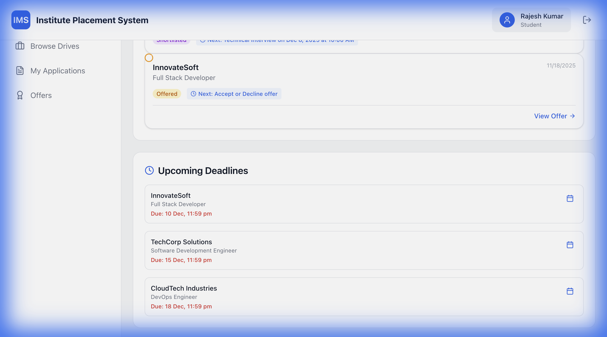
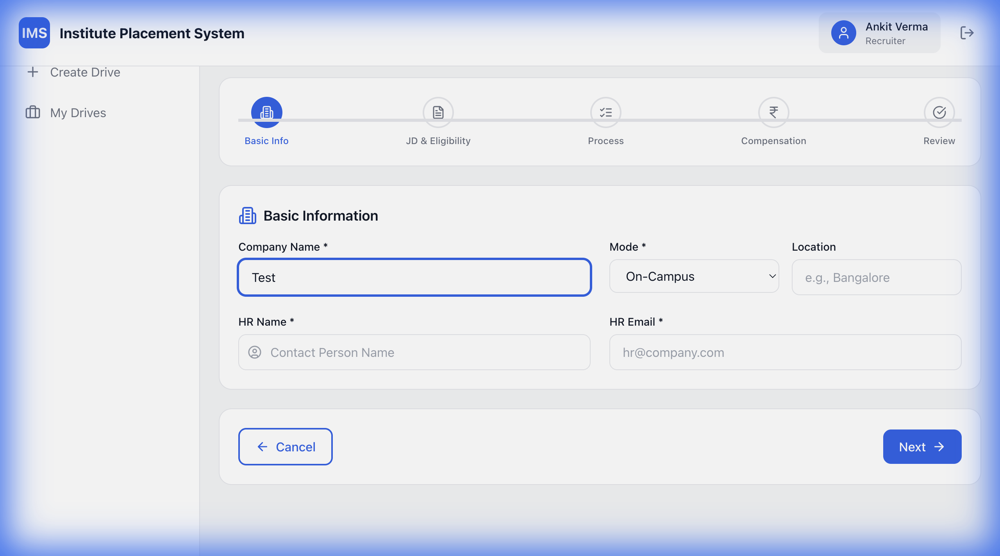
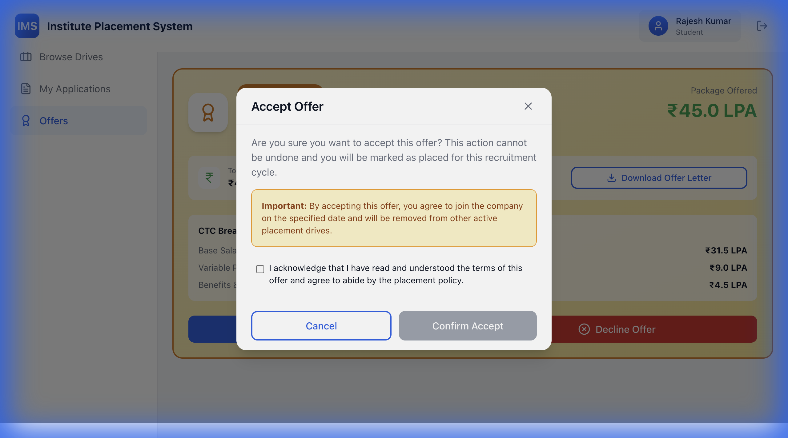
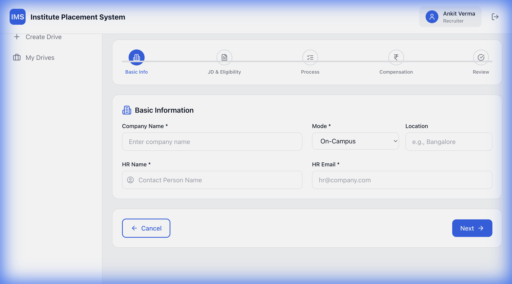

# Heuristic Evaluation Report: IMS Prototype

**Date:** December 4, 2025
**System:** Institute Management System (IMS) - High-Fidelity Prototype

---

## Executive Summary

The IMS prototype demonstrates a strong foundation in usability, particularly in its clean aesthetic and role-based workflows. The recent additions of the **Student Placement Timeline** and **Recruiter Edit Flow** have significantly improved system visibility and user control. However, minor gaps remain in error prevention (undo actions) and comprehensive help documentation. The system scores highly on consistency and match with real-world processes.

---

## Detailed Heuristic Analysis

### Heuristic 1: Visibility of System Status
*The system should always keep users informed about what is going on, through appropriate feedback within a reasonable time.*

*   **Observations:**
    *   **Student Dashboard:** The new `PlacementTimeline` component clearly visualizes the application lifecycle (Applied → Shortlisted → Interview → Offer).
    *   **Recruiter Wizard:** The 5-step progress bar explicitly shows the current step and total steps.
    *   **Feedback:** Toast notifications ("Drive submitted", "Offer accepted") provide immediate feedback for actions.
*   **Issues Identified:**
    *   Loading states during data fetching (e.g., dashboard load) are currently implicit (no skeleton screens observed in code).
*   **Severity:** 2 (Minor Usability Problem)
*   **Recommendations:**
    *   Implement skeleton loaders for dashboard cards to indicate data fetching status.

### Heuristic 2: Match Between System and the Real-World Language
*The system should speak the users' language, with words, phrases, and concepts familiar to the user.*

*   **Observations:**
    *   Terminology matches the domain perfectly: "CTC", "Stipend", "Backlogs", "Drive", "Shortlist".
    *   The "Smart Branch Selection" uses academic terms like "B.Tech - CSE" which is familiar to recruiters and SPCs.
*   **Issues Identified:**
    *   None significant. The language is well-aligned with the target audience (Institute Placement Cells).
*   **Severity:** 0 (No Usability Problem)
*   **Recommendations:**
    *   Maintain this consistency in future features.

### Heuristic 3: User Control and Freedom
*Users often choose system functions by mistake and will need a clearly marked "emergency exit" to leave the unwanted state.*

*   **Observations:**
    *   **Recruiter Wizard:** Users can navigate "Back" to previous steps.
    *   **Modals:** All modals (Offer Accept/Decline, Curriculum View) have clear "Cancel" or "Close" buttons.
    *   **Edit Flow:** Recruiters can now "Continue Editing" drafts, preventing data loss if they leave midway.
*   **Issues Identified:**
    *   There is no "Undo" option for critical actions like "Decline Offer" (though a confirmation modal exists).
*   **Severity:** 2 (Minor Usability Problem)
*   **Recommendations:**
    *   Consider a short "Undo" toast window (5-10s) for actions like declining an offer or deleting a draft.

### Heuristic 4: Consistency and Standards
*Users should not have to wonder whether different words, situations, or actions mean the same thing.*

*   **Observations:**
    *   **Visual Design:** Consistent color tokens (Primary Blue `#2563EB`, Success Green `#16A34A`) used across all roles.
    *   **Components:** Buttons, Inputs, and Cards follow a strict design system.
    *   **Navigation:** Top navigation bar is consistent, though the spec requested a Sidebar for SPC/Recruiter (a deviation, but internally consistent).
*   **Issues Identified:**
    *   Navigation structure deviates from the original spec (Top Nav vs Sidebar), which might be inconsistent with complex admin dashboard standards.
*   **Severity:** 1 (Cosmetic Problem)
*   **Recommendations:**
    *   Migrate SPC and Recruiter views to a Sidebar navigation layout to better accommodate growing administrative features.

### Heuristic 5: Error Prevention
*Even better than good error messages is a careful design which prevents a problem from occurring in the first place.*

*   **Observations:**
    *   **Offer Page:** Confirmation modals require explicit acknowledgement ("I acknowledge...") before accepting, preventing accidental clicks.
    *   **Wizard:** "Next" button validation prevents moving forward without required fields.
    *   **Eligibility:** Students cannot register for drives they are not eligible for (button disabled).
*   **Issues Identified:**
    *   No "Save as Draft" button in the Wizard; it autosaves or relies on state persistence, which isn't explicitly clear to the user.
*   **Severity:** 2 (Minor Usability Problem)
*   **Recommendations:**
    *   Add an explicit "Save Draft" button in the Recruiter Wizard for peace of mind.

### Heuristic 6: Recognition Rather Than Recall
*Minimize the user's memory load by making objects, actions, and options visible.*

*   **Observations:**
    *   **Smart Suggestions:** The "Suggest from JD" feature helps recruiters select branches without recalling every specific degree code.
    *   **Curriculum Modal:** Recruiters can view curriculum details in-context without leaving the wizard.
    *   **Dashboard:** "Quick Actions" provide visible shortcuts to common tasks.
*   **Issues Identified:**
    *   In the "Process" step of the wizard, users have to manually type round names. Pre-defined chips (e.g., "Aptitude", "Coding", "HR") would aid recognition.
*   **Severity:** 1 (Cosmetic Problem)
*   **Recommendations:**
    *   Add "Common Rounds" chips in the Process step for one-click addition.

### Heuristic 7: Flexibility and Efficiency of Use
*Accelerators — unseen by the novice user — may often speed up the interaction for the expert user.*

*   **Observations:**
    *   **Filters:** Dashboards have filters for status (Draft, Published), aiding quick retrieval.
    *   **Quick Actions:** Prominent buttons for high-frequency tasks.
*   **Issues Identified:**
    *   No bulk actions (e.g., "Bulk Approve" for SPC) observed in the current prototype.
*   **Severity:** 2 (Minor Usability Problem)
*   **Recommendations:**
    *   Implement bulk selection and action capabilities in the SPC "Pending Drives" table.

### Heuristic 8: Aesthetic and Minimalist Design
*Dialogues should not contain information which is irrelevant or rarely needed.*

*   **Observations:**
    *   The UI is clean, using ample whitespace and a "Card" metaphor.
    *   Information is progressively disclosed (e.g., Wizard steps, Tabs in Drive Details).
    *   **Visuals:** Use of icons (Lucide React) adds visual cues without clutter.
*   **Issues Identified:**
    *   None. The design adheres well to modern, minimalist principles.
*   **Severity:** 0 (No Usability Problem)
*   **Recommendations:**
    *   Maintain the current visual hierarchy.

### Heuristic 9: Help Users Recognize, Diagnose, and Recover from Errors
*Error messages should be expressed in plain language (no codes), precisely indicate the problem, and suggest a solution.*

*   **Observations:**
    *   **Form Validation:** The Wizard shows "Please fill all required fields" toast.
    *   **Input Fields:** Required fields are marked with asterisks.
*   **Issues Identified:**
    *   Validation messages are generic ("Please fill all required fields") rather than specific (e.g., "Company Name is required").
    *   No inline error text below specific invalid inputs; relies on global toasts.
*   **Severity:** 3 (Major Usability Problem)
*   **Recommendations:**
    *   Implement inline field validation messages (red text below the input) for immediate, specific feedback.

### Heuristic 10: Help and Documentation
*Even though it is better if the system can be used without documentation, it may be necessary to provide help and documentation.*

*   **Observations:**
    *   **Contextual Help:** "Info" icons in the Wizard provide curriculum details.
    *   **Helper Text:** Input fields have helper text (e.g., "Enter the total annual cost to company").
*   **Issues Identified:**
    *   No dedicated "Help Center" or "FAQ" section for users (e.g., "How to calculate CGPA?").
*   **Severity:** 1 (Cosmetic Problem)
*   **Recommendations:**
    *   Add a "Help" link in the navigation bar or a floating support widget.

---

## Prioritized Fix List

### 🔴 Must Fix (Critical)
1.  **Inline Validation (Heuristic 9):** Replace generic error toasts with specific, inline error messages in forms (especially the Wizard) to help users diagnose issues faster.

### 🟡 Should Fix (Important)
1.  **Skeleton Loaders (Heuristic 1):** Add loading states for dashboards to improve perceived performance.
2.  **Bulk Actions (Heuristic 7):** Allow SPCs to bulk approve/reject drives to improve efficiency.
3.  **Undo Actions (Heuristic 3):** Add "Undo" functionality for destructive actions like declining offers.

### 🟢 Could Fix (Nice-to-Have)
1.  **Pre-defined Process Chips (Heuristic 6):** Add quick-select chips for common interview rounds.
2.  **Sidebar Navigation (Heuristic 4):** Refactor SPC/Recruiter layout to use a sidebar for better scalability.
3.  **Help Center (Heuristic 10):** Add a dedicated help section.

---

**Overall UX Summary:**
The IMS prototype is a robust, user-friendly application that scores highly on **Match with Real World** and **Aesthetic Design**. The role-based workflows are logical and well-structured. The primary area for improvement is **Error Recovery** (specifically inline validation) and **Efficiency** (bulk actions for admins). Addressing the "Must Fix" item will bring the prototype to a near-production usability standard.
